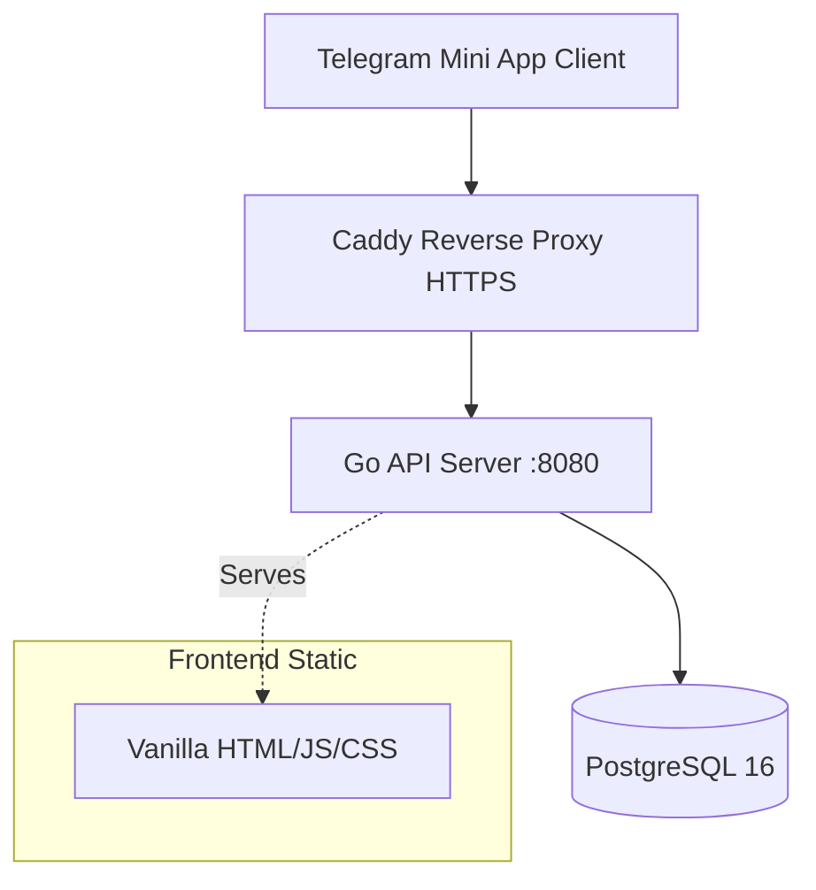

# 🏋️ Workout Challenge Tracker


Telegram Mini App для спортивной мотивации: создавайте челленджи, логируйте тренировки, отслеживайте прогресс и зарабатывайте достижения — прямо внутри Telegram.

## Tech Stack

| Слой | Технологии |
|------|-----------|
| **Frontend** | Vanilla HTML5, CSS3, JavaScript (ES6+ модули, Pub-Sub Store, SPA Router). Без фреймворков. Интеграция с [Telegram WebApp SDK](https://core.telegram.org/bots/webapps). |
| **Backend** | Go (Golang) — чистый `net/http`, `pgxpool`, HMAC-валидация Telegram `initData`. |
| **Database** | PostgreSQL 16 (Docker). |
| **Proxy** | Caddy 2 (автоматический HTTPS, reverse proxy). |
| **CI/CD** | GitHub Actions → автодеплой на VPS при пуше в `main`. |

## Архитектура



- **Аутентификация**: Telegram `initData` передаётся в заголовке `Authorization: Bearer <initData>`. Middleware валидирует HMAC-подпись через бот-токен и извлекает `user_id`.
- **Изоляция данных**: все SQL-запросы фильтруются по `user_id` — каждый пользователь видит только свои данные.
- **Фоновые задачи**: cron-воркер автоматически помечает просроченные челленджи как `failed`.

Подробнее: [docs/architecture.md](docs/architecture.md).

---

## Переменные окружения

| Переменная | Описание | Обязательна |
|-----------|----------|:-----------:|
| `DATABASE_DSN` | PostgreSQL connection string | ✅ |
| `PORT` | Порт HTTP-сервера (по умолчанию `8080`) | — |
| `TELEGRAM_BOT_TOKEN` | Токен Telegram-бота для валидации `initData` | ✅ (прод) |
| `APP_ENV` | `production` или `development` | ✅ (прод) |

> ⚠️ **Важно**: если `APP_ENV` не задан, приложение запускается в режиме `development` — авторизация через Telegram **отключена**, все запросы идут от имени `default_user_1`. Для продакшена **обязательно** укажите `APP_ENV=production`.

---

## Запуск

### Продакшен (Docker Compose)

1. Создайте файл `.env` в корне проекта (пример в `.env.example`):
   ```env
   DB_USER=postgres
   DB_PASSWORD=your_secure_password
   DB_NAME=workout_tracker
   TELEGRAM_BOT_TOKEN=your_bot_token_here
   ```

2. Убедитесь, что в `Caddyfile` указан ваш домен.

3. Запустите все сервисы:
   ```bash
   docker compose up -d --build
   ```

   Будут подняты три контейнера:
   - `workout-db` — PostgreSQL
   - `workout-app` — Go-сервер (миграции при старте, `APP_ENV=production`)
   - `caddy-proxy` — HTTPS reverse proxy

4. Зарегистрируйте URL вашего Mini App в [@BotFather](https://t.me/BotFather).

### Локальная разработка (с использованием Makefile)

Для запуска без Telegram (режим `development`):

```bash
# 1. Запустить БД и сервер одной командой
make run

# Дополнительные команды:
# make test     - Запуск тестов
# make lint     - Запуск линтера
# make swagger  - Генерация Swagger-документации
# make clean    - Остановка контейнеров и удаление бинарников
```

После старта `make run`, откройте в браузере:
- Приложение: `http://localhost:8080/`
- Swagger UI (API Docs): `http://localhost:8080/api/swagger/index.html`

В режиме разработки авторизация через Telegram отключена — можно тестировать API напрямую, передавая `X-User-Id` в заголовке запроса.

---

## CI/CD

При пуше в ветку `main` автоматически запускается GitHub Actions пайплайн:

1. **Build & Test** — сборка, Go unit-тесты, API интеграционные тесты, Playwright E2E тесты.
2. **Deploy** — SSH на VPS, `git pull`, `docker compose up -d --build`.

---

## Структура проекта

```
├── frontend/          # SPA-фронтенд (HTML/CSS/JS)
│   ├── js/
│   │   ├── api.js         # HTTP-клиент с Telegram auth
│   │   ├── app.js         # Инициализация приложения
│   │   ├── store.js       # Pub-Sub состояние
│   │   ├── router.js      # SPA-роутер
│   │   ├── telegram.js    # Обёртка над Telegram WebApp SDK
│   │   └── components/    # UI-компоненты
│   └── css/
├── internal/
│   ├── auth/          # Валидация Telegram initData (HMAC)
│   ├── config/        # Конфигурация из env-переменных
│   ├── database/      # SQL-запросы (pgxpool)
│   ├── handlers/      # HTTP-хэндлеры + middleware
│   ├── models/        # Структуры данных
│   └── workers/       # Фоновые задачи (cron)
├── tests/             # Playwright E2E тесты
├── docker-compose.yml # Продакшен-оркестрация
├── Dockerfile         # Multi-stage сборка Go-приложения
├── Caddyfile          # HTTPS reverse proxy
└── .github/workflows/ # CI/CD пайплайн
```
