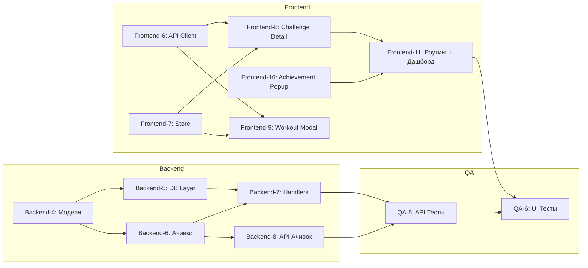

# Kanban Board

## 🚀 Спринт №3 (US-3: Логирование тренировки и Ачивки)
**Цель спринта:** Реализовать полный цикл добавления и удаления тренировок с транзакционным пересчётом прогресса, систему достижений (ачивок) с поздравительными поп-апами и страницу деталей челленджа.

### 🔗 Граф зависимостей



> **Параллельный старт:** Backend-4, Frontend-6, Frontend-7 и Frontend-10 не имеют входящих зависимостей — могут стартовать одновременно.

---

### TO DO

- [ ] **Backend-4: Модель Workout и структуры ответа**
  * **Файлы:** `internal/models/workout.go` **(NEW)**, `internal/models/achievement.go` **(NEW)**
  * **Описание:**
    1. Создать файл `internal/models/workout.go` со структурой `Workout`:
       * `ID` (int), `UserID` (string), `ChallengeID` (int), `WorkoutDate` (time.Time), `Value` (int), `CreatedAt` (time.Time).
       * JSON-теги: `id`, `user_id`, `challenge_id`, `workout_date`, `value`, `created_at`.
    2. Создать файл `internal/models/achievement.go` со структурами:
       * `Achievement`: `ID` (int), `UserID` (string), `AchievementCode` (string), `UnlockedAt` (time.Time).
       * `AchievementDefinition`: `Code` (string), `Name` (string), `Description` (string), `Icon` (string).
    3. Создать структуру ответа `WorkoutResponse`:
       * `Success` (bool), `Workout` (Workout), `UnlockedAchievements` ([]string).
       * JSON-тег `unlocked_achievements` — строго по контракту API из `spec.md`.
  * **Ограничения:**
    * Поля JSON-тегов должны строго соответствовать контракту API из `spec.md`.
    * `WorkoutDate` использует `time.Time` для корректной сериализации.
  * **Зависимости:** Нет. Можно начинать сразу.

---

- [ ] **Backend-5: Database Layer — CRUD Workouts с транзакциями**
  * **Файлы:** `internal/database/workout.go` **(NEW)**
  * **Описание:**
    1. **Метод `CreateWorkout(ctx, userID, challengeID, workout) (*models.Workout, error)`:**
       * Работает **внутри SQL-транзакции** (`db.Pool.Begin(ctx)`).
       * Шаг 1: Проверить, что челлендж с `challenge_id` существует, принадлежит `user_id` и имеет статус `'active'`. Если нет — вернуть ошибку. Использовать `SELECT ... FOR UPDATE` для блокировки строки.
       * Шаг 2: Вставить запись в таблицу `workouts`:
         ```sql
         INSERT INTO workouts (user_id, challenge_id, workout_date, value)
         VALUES ($1, $2, $3, $4)
         RETURNING id, created_at
         ```
       * Шаг 3: Обновить `current_progress` в таблице `challenges`:
         ```sql
         UPDATE challenges
         SET current_progress = current_progress + $1,
             status = CASE
                 WHEN current_progress + $1 >= target_value THEN 'completed'
                 ELSE status
             END
         WHERE id = $2
         RETURNING current_progress, target_value, status
         ```
       * Шаг 4: `tx.Commit()`. При любой ошибке — `tx.Rollback()`.
    2. **Метод `DeleteWorkout(ctx, userID, workoutID) (*models.Challenge, error)`:**
       * Работает **внутри SQL-транзакции**.
       * Шаг 1: Получить `workout` по `id` и `user_id`, извлечь `challenge_id` и `value`. Если не найден — вернуть ошибку.
       * Шаг 2: Удалить запись из `workouts`:
         ```sql
         DELETE FROM workouts WHERE id = $1 AND user_id = $2
         ```
       * Шаг 3: Обновить `current_progress` в `challenges` с каскадным откатом статуса:
         ```sql
         UPDATE challenges
         SET current_progress = GREATEST(current_progress - $1, 0),
             status = CASE
                 WHEN status = 'completed' AND (current_progress - $2) < target_value THEN 'active'
                 ELSE status
             END
         WHERE id = $3
         RETURNING id, user_id, name, exercise_id, target_value, current_progress, start_date, end_date, status
         ```
       * Шаг 4: `tx.Commit()`. При ошибке — `tx.Rollback()`.
       * Возвращает обновлённый объект `Challenge`.
    3. **Метод `GetWorkoutsByChallenge(ctx, userID, challengeID) ([]models.Workout, error)`:**
       * `SELECT` всех тренировок по `challenge_id` и `user_id`, отсортированных по `workout_date DESC, created_at DESC`.
       * Возвращает пустой слайс `[]models.Workout{}`, а не `nil`, если записей нет.
  * **Ограничения:**
    * **Обязательно** использовать транзакции для `CreateWorkout` и `DeleteWorkout` — критично для целостности данных.
    * Не использовать ORM. Только чистый SQL через `pgx`.
    * Логировать ошибки через `log.Printf` перед возвратом.
    * Параметр `value` проходит CHECK-ограничение на уровне БД (`value > 0`), но дополнительно валидировать на уровне хэндлера.
  * **Зависимости:** Backend-4 (модели).

---

- [ ] **Backend-6: Движок ачивок (Achievement Engine)**
  * **Файлы:** `internal/database/achievement.go` **(NEW)**
  * **Описание:**
    1. **Метод `CheckAndUnlockAchievements(ctx, userID, challengeID, newProgress, targetValue int) ([]string, error)`:**
       * Вызывается **после успешного добавления тренировки** (после коммита транзакции `CreateWorkout`).
       * Проверяет условия для 4 ачивок и возвращает массив `[]string` с кодами только **НОВЫХ** ачивок.
       * Логика проверок:
         * **`first_step` — «Первый шаг»:** У пользователя существует хотя бы одна запись в `workouts`. SQL: `SELECT EXISTS(SELECT 1 FROM workouts WHERE user_id = $1 LIMIT 1)`.
         * **`equator` — «Экватор»:** `newProgress * 2 >= targetValue` (50% от цели). Проверка по аргументам.
         * **`hero` — «Герой»:** `newProgress >= targetValue` И `end_date` челленджа ≥ `CURRENT_DATE` (завершил до дедлайна). SQL: получить `end_date` и сравнить.
         * **`stability` — «Стабильность»:** Есть тренировки за 3 **последовательных** календарных дня. SQL: `SELECT DISTINCT workout_date FROM workouts WHERE user_id = $1 ORDER BY workout_date DESC LIMIT 10`. На Go проверить 3 подряд идущие даты.
    2. **Вспомогательный метод `unlockAchievement(ctx, userID, code string) (bool, error)`:**
       * `INSERT INTO user_achievements (user_id, achievement_code) VALUES ($1, $2) ON CONFLICT DO NOTHING`.
       * Возвращает `true` если запись вставлена (новая), `false` если уже была.
    3. **Метод `GetUserAchievements(ctx, userID) ([]models.Achievement, error)`:**
       * `SELECT * FROM user_achievements WHERE user_id = $1 ORDER BY unlocked_at ASC`.
       * Возвращает пустой слайс если ачивок нет.
  * **Ограничения:**
    * Идемпотентность: `ON CONFLICT DO NOTHING` + `UNIQUE(user_id, achievement_code)`.
    * `CheckAndUnlockAchievements` **никогда не роняется** — если одна проверка упала, залогировать и продолжить остальные.
    * Возвращать только **вновь разблокированные** коды.
  * **Зависимости:** Backend-4 (модели).

---

- [ ] **Backend-7: HTTP Handlers для Workouts и регистрация маршрутов**
  * **Файлы:** `internal/handlers/workout_handler.go` **(NEW)**, `internal/handlers/router.go` **(MODIFY)**
  * **Описание:**
    1. **Создать `WorkoutHandler` в `workout_handler.go`:**
       * **`HandleCreateWorkout` — `POST /api/challenges/:id/workouts`:**
         * Извлечь `X-User-Id` из заголовков.
         * Извлечь `challengeID` из URL: `strings.Split(strings.Trim(r.URL.Path, "/"), "/")` → индекс 2.
         * Десериализовать тело запроса (`WorkoutDate`, `Value`).
         * **Валидация:** `value > 0` → иначе 400; `workout_date` валидна → иначе 400.
         * Вызвать `db.CreateWorkout(ctx, userID, challengeID, &workout)`.
         * При успехе — вызвать `db.CheckAndUnlockAchievements(ctx, userID, challengeID, newProgress, targetValue)`.
         * Сформировать ответ: `{ "success": true, "workout": {...}, "unlocked_achievements": [...] }`.
         * HTTP `201 Created`.
         * **Важно:** Если `CheckAndUnlockAchievements` упал — залогировать, вернуть 201 с пустым `unlocked_achievements: []`.
       * **`HandleDeleteWorkout` — `DELETE /api/workouts/:id`:**
         * Извлечь `X-User-Id` и `workoutID` из URL (индекс 2).
         * Вызвать `db.DeleteWorkout(ctx, userID, workoutID)`.
         * Не найден → 404. Ошибка БД → 500.
         * При успехе: `{ "success": true, "challenge": {...} }`. HTTP `200 OK`.
    2. **Обновить `router.go`:**
       * Расширить маршрут `/api/challenges/`: если URL заканчивается на `/workouts` + `POST` → `workoutHandler.HandleCreateWorkout`. Иначе — `challengeHandler.HandleGetByID` (как раньше).
       * Новый маршрут `/api/workouts/`: `DELETE` → `workoutHandler.HandleDeleteWorkout`.
  * **Ограничения:**
    * Не ломать существующие маршруты (`GET /api/challenges/:id`).
    * Все ошибки логировать через `log.Printf`.
    * Заголовок ответа: `Content-Type: application/json`.
    * `unlocked_achievements` **всегда** `[]`, а не `null`.
  * **Зависимости:** Backend-5, Backend-6.

---

- [ ] **Backend-8: API для получения ачивок пользователя**
  * **Файлы:** `internal/handlers/achievement_handler.go` **(NEW)**, `internal/handlers/router.go` **(MODIFY)**
  * **Описание:**
    1. **Создать `AchievementHandler` в `achievement_handler.go`:**
       * **`HandleList` — `GET /api/achievements`:**
         * Извлечь `X-User-Id` из заголовков.
         * Вызвать `db.GetUserAchievements(ctx, userID)`.
         * Вернуть массив ачивок. Пустой → `[]`, не `null`.
         * HTTP `200 OK`.
    2. **Зарегистрировать в `router.go`:**
       * `mux.HandleFunc("/api/achievements", ...)` → `GET` → `achievementHandler.HandleList`.
  * **Ограничения:**
    * Эндпоинт нужен для дашборда — подсветка разблокированных ачивок при загрузке.
  * **Зависимости:** Backend-6.

---

- [ ] **Frontend-6: API Client — Workout & Achievement Methods**
  * **Файл:** `frontend/js/api.js` **(MODIFY)**
  * **Описание:**
    1. Добавить метод `createWorkout(challengeId, payload)`:
       * `POST /api/challenges/${challengeId}/workouts`
       * Тело: `{ "workout_date": "YYYY-MM-DD", "value": number }`
       * Возвращает весь JSON-ответ: `{ success, workout, unlocked_achievements }`.
    2. Добавить метод `deleteWorkout(workoutId)`:
       * `DELETE /api/workouts/${workoutId}`
       * Возвращает: `{ success, challenge }`.
    3. Добавить метод `getChallengeDetail(challengeId)`:
       * `GET /api/challenges/${challengeId}`
       * Возвращает детальную информацию о челлендже.
    4. Добавить метод `getAchievements()`:
       * `GET /api/achievements`
       * Возвращает массив разблокированных ачивок.
  * **Ограничения:**
    * Все методы используют существующий `_request()` — не дублировать логику.
    * `X-User-Id` прикрепляется автоматически.
  * **Зависимости:** Нет. Можно начинать сразу.

---

- [ ] **Frontend-7: Store — Состояние для Workouts и Achievements**
  * **Файл:** `frontend/js/store.js` **(MODIFY)**
  * **Описание:**
    1. Добавить новые поля в `this.state`:
       * `currentChallenge: null` — детали текущего просматриваемого челленджа.
       * `workouts: []` — список тренировок текущего челленджа.
       * `achievements: []` — разблокированные ачивки пользователя.
    2. Добавить методы:
       * `setCurrentChallenge(challenge)` — устанавливает текущий челлендж.
       * `setWorkouts(workouts)` — устанавливает список тренировок.
       * `addWorkout(workout)` — добавляет тренировку в **начало** массива (сортировка DESC).
       * `removeWorkout(workoutId)` — удаляет тренировку по `id`.
       * `updateChallengeProgress(challengeId, newProgress, newStatus)` — обновляет `current_progress` и `status` в массиве `challenges` **И** в `currentChallenge` (если совпадает `id`). Критично для мгновенного пересчёта прогресс-бара.
       * `setAchievements(achievements)` — устанавливает массив ачивок.
       * `addAchievements(newCodes)` — добавляет новые коды ачивок.
  * **Ограничения:**
    * Все методы вызывают `this.setState(...)` / `this.notify()`.
    * `updateChallengeProgress` обновляет **и** `challenges`, **и** `currentChallenge`, иначе при возврате на дашборд прогресс-бар будет устаревшим.
  * **Зависимости:** Нет. Можно начинать сразу.

---

- [ ] **Frontend-8: Компонент «Страница деталей челленджа» (Challenge Detail)**
  * **Файлы:** `frontend/js/components/challenge/challenge-detail.js` **(NEW)**, `frontend/css/main.css` **(MODIFY)**
  * **Описание:**
    1. **Создать класс `ChallengeDetail`** с методами `constructor(container)`, `mount()`, `unmount()`, `render()`.
    2. **При монтировании:**
       * Получить `currentChallengeId` из `store.getState()`.
       * Вызвать `api.getChallengeDetail(id)` → `store.setCurrentChallenge(challenge)`.
       * Подписаться на изменения стора.
    3. **Рендеринг — что отображать:**
       * **Заголовок:** Кнопка «← Назад» (→ `store.navigate('dashboard')`), название, статус-бейдж.
       * **Прогресс-бар (крупный):** Процент, текст `"X / Y"`, визуальная полоса (высота 12px).
       * **Таймер обратного отсчёта:** Разница `end_date` и сегодня. Формат: `"Осталось: X дней"` или `"Дедлайн истёк"`. Если `completed` → `"Челлендж завершён! 🎉"`.
       * **Кнопка «Добавить тренировку»:** Открывает модалку (Frontend-9). **Заблокирована** если `completed` / `failed`.
       * **История тренировок:** Список карточек (дата DD.MM.YYYY, value, иконка 🗑️). Пустое состояние: `"Тренировок пока нет..."`.
       * **Обработка удаления:** `click` на 🗑️ → `confirm()` → `api.deleteWorkout(id)` → `store.removeWorkout(id)` + `store.updateChallengeProgress(...)` + `store.setCurrentChallenge(...)`. При ошибке — тост.
    4. **CSS стили:** `.challenge-detail`, `.challenge-detail-header`, `.countdown-timer`, `.workout-list-item`, `.add-workout-btn`.
  * **Ограничения:**
    * Vanilla JS, никаких фреймворков.
    * Прогресс-бар обновляется **мгновенно** без перезагрузки страницы (AC-1).
    * Допустимый подход для MVP: `innerHTML` с сохранением scroll-позиции.
  * **Зависимости:** Frontend-6, Frontend-7.

---

- [ ] **Frontend-9: Модальное окно «Добавить тренировку» (Workout Modal)**
  * **Файлы:** `frontend/js/components/ui/workout-modal.js` **(NEW)**, `frontend/css/main.css` **(MODIFY)**
  * **Описание:**
    1. **Создать класс `WorkoutModal`** с методами `constructor()`, `open(challengeId)`, `close()`.
    2. **Разметка:** Оверлей с формой: поле даты (`type="date"`, дефолт — сегодня), поле количества (`type="number"`, `min="1"`), кнопка «Сохранить».
    3. **Логика отправки:**
       * Клиентская валидация: `value > 0`, `workout_date` заполнено.
       * Блокировка кнопки на время запроса.
       * `api.createWorkout(challengeId, { workout_date, value })`.
       * **При успехе:**
         1. `store.addWorkout(response.workout)`.
         2. `store.updateChallengeProgress(challengeId, newProgress, newStatus)`.
         3. Закрыть модалку.
         4. Тост `"Тренировка добавлена! +{value} повторений"`.
         5. Если `unlocked_achievements.length > 0` → показать Achievement Popup (Frontend-10).
       * **При ошибке:** Тост с ошибкой, разблокировка кнопки.
    4. **Закрытие:** Клик по оверлею, кнопка `×`, клавиша `Escape`.
    5. **CSS:** `.modal-overlay`, `.modal-content`, `.modal-header`, `.modal-close-btn`. Анимация `fadeIn 0.2s`.
  * **Ограничения:**
    * Модалка рендерится в `document.body`, не в `#app`.
    * Удалять DOM и снимать `keydown` листенер при `close()`.
    * Дата по умолчанию: `new Date().toISOString().split('T')[0]`.
  * **Зависимости:** Frontend-6, Frontend-7.

---

- [ ] **Frontend-10: Поздравительный поп-ап при получении ачивки (Achievement Popup)**
  * **Файлы:** `frontend/js/components/ui/achievement-popup.js` **(NEW)**, `frontend/css/main.css` **(MODIFY)**
  * **Описание:**
    1. **Создать функцию `showAchievementPopup(achievementCodes)`:**
       * Принимает массив кодов: `["first_step", "equator"]`.
       * Локальный маппинг:
         * `first_step`: 🌱 «Первый шаг» — «Внесена первая тренировка».
         * `equator`: 📈 «Экватор» — «Прогресс достиг 50%».
         * `hero`: ⚡ «Герой» — «Челлендж завершён до дедлайна!».
         * `stability`: 🔥 «Стабильность» — «Тренировки 3 дня подряд».
       * Рендерит оверлей с **анимированной** карточкой: иконка, название, описание, кнопка «Отлично!».
       * Несколько ачивок → показ **последовательно** (закрыл один → показался следующий).
    2. **Анимация:** `scale(0.8→1)` + `opacity 0→1` (300ms). Иконка пульсирует (`@keyframes pulse`). Оверлей с `backdrop-filter: blur(4px)`.
    3. **Закрытие:** Кнопка «Отлично!», клик по оверлею, автозакрытие через 5 сек (с прогресс-баром).
    4. **CSS:** `.achievement-popup-overlay`, `.achievement-popup-card` с gradient-бордером (`linear-gradient(135deg, #FFD700, #FFA500, #FF6347)`), `.achievement-icon` (64px + pulse), `.achievement-auto-close-bar`.
  * **Ограничения:**
    * Рендерится в `document.body`.
    * Очищать DOM и таймеры при закрытии.
    * 2+ ачивок → очередь, не показывать все разом.
  * **Зависимости:** Нет (утилитарный компонент).

---

- [ ] **Frontend-11: Регистрация маршрута Challenge Detail и обновление дашборда**
  * **Файлы:** `frontend/js/app.js` **(MODIFY)**, `frontend/js/components/dashboard/dashboard.js` **(MODIFY)**
  * **Описание:**
    1. **В `app.js`:**
       * Импортировать `ChallengeDetail` из `./components/challenge/challenge-detail.js`.
       * Добавить маршрут: `'challenge-detail': ChallengeDetail`.
       * При инициализации загрузить ачивки: `api.getAchievements()` → `store.setAchievements(...)`.
    2. **В `dashboard.js`:**
       * **Кликабельные карточки:** Обработчик `click` на `.challenge-card` → `store.navigate('challenge-detail', { currentChallengeId: id })`.
       * **Динамические ачивки:** Заменить захардкоженный блок ачивок на динамический. Маппинг: `first_step/🌱`, `equator/📈`, `hero/⚡`, `stability/🔥`. Разблокированные — яркие (`opacity: 1`), остальные — серые (`opacity: 0.3; filter: grayscale(100%)`).
  * **Ограничения:**
    * Не ломать существующую навигацию `dashboard` ↔ `challenge-form`.
    * Карточки: `cursor: pointer` + hover-стили из CSS.
  * **Зависимости:** Frontend-6, Frontend-7, Frontend-8, Frontend-10.

---

- [ ] **QA-5: API Тестирование Workouts и Ачивок (cURL / Postman)**
  * **Описание:** Набор из 17 тест-кейсов для проверки API:
    * **Добавление тренировки:**
      * TC-3.1 (Positive): Успешное добавление, проверка `201`, `unlocked_achievements: ["first_step"]`, обновление `current_progress`.
      * TC-3.2 (Positive): Ачивка «Экватор» при достижении 50%.
      * TC-3.3 (Positive): Ачивка «Герой» при 100% до дедлайна, `status → completed`.
      * TC-3.4 (Positive): Ачивка «Стабильность» при 3 днях подряд.
      * TC-3.5 (Negative): Отрицательное `value` → 400.
      * TC-3.6 (Negative): `value = 0` → 400.
      * TC-3.7 (Negative): Несуществующий челлендж → 400/404.
      * TC-3.8 (Negative): Завершённый челлендж → 400.
      * TC-3.9 (Edge): Пустая дата → 400.
      * TC-3.10 (Edge): Ачивки не дублируются.
    * **Удаление тренировки:**
      * TC-3.11 (Positive): Успешное удаление, `current_progress` уменьшился.
      * TC-3.12 (Positive): Каскадный откат `completed → active`.
      * TC-3.13 (Negative): Несуществующая тренировка → 404.
      * TC-3.14 (Negative): Чужая тренировка → 404.
      * TC-3.15 (Edge): `current_progress` не уходит ниже 0.
    * **API Ачивок:**
      * TC-3.16 (Positive): Получение списка ачивок.
      * TC-3.17 (Positive): Пустой список → `[]`, не `null`.
  * **Зависимости:** Backend-4, Backend-5, Backend-6, Backend-7, Backend-8.

---

- [ ] **QA-6: UI/UX Тестирование Workouts и Ачивок (Браузер)**
  * **Описание:** Набор из 13 тест-кейсов для UI:
    * **Навигация:**
      * TC-3.18: Переход на страницу деталей по клику на карточку.
      * TC-3.19: Кнопка «Назад» возвращает на дашборд.
    * **Добавление тренировки:**
      * TC-3.20: E2E флоу — прогресс-бар мгновенно обновляется без перезагрузки (AC-1).
      * TC-3.21: Поздравительный поп-ап при «Экватор» (AC-2).
      * TC-3.22: Валидация — пустое количество.
      * TC-3.23: Валидация — отрицательное количество.
    * **Удаление тренировки:**
      * TC-3.24: Удаление из списка, пересчёт прогресса.
      * TC-3.25: Откат `completed → active` после удаления (US-4 AC-1).
      * TC-3.26: Отмена удаления в `confirm()`.
    * **Ачивки и модалки:**
      * TC-3.27: Подсветка разблокированных ачивок на дашборде.
      * TC-3.28: Модалка закрывается по оверлею и Escape.
    * **Граничные случаи:**
      * TC-3.29: 100% прогресс и возврат на дашборд.
      * TC-3.30: Множественные ачивки за одну тренировку (3 последовательных поп-апа).
  * **Зависимости:** Frontend-6...Frontend-11, Backend-4...Backend-8 (полная интеграция).

---

### IN PROGRESS

### QA / REVIEW

### DONE
